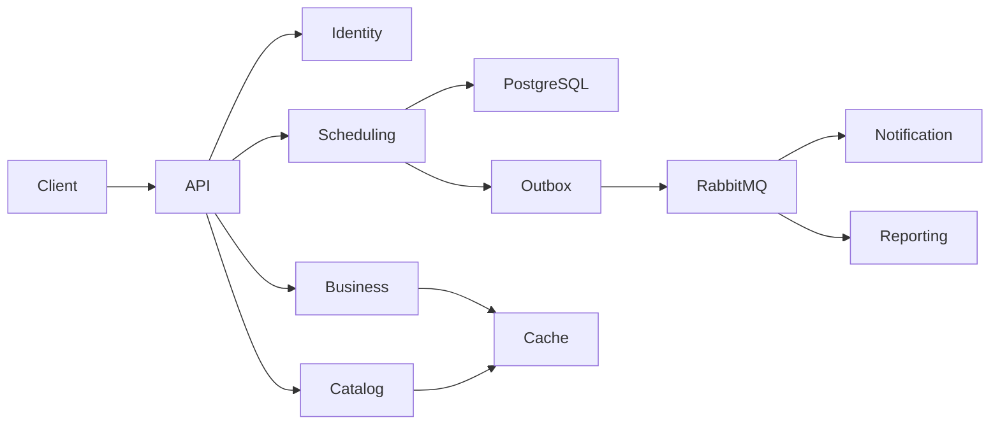

# Salon Booking API

Plataforma SaaS de agendamento para barbearias e salões de beleza — API REST enterprise, construída como **Modular Monolith** com DDD, Arquitetura Hexagonal e Event-Driven Architecture.

[]()
[]()
[]()
[]()
[]()

---

## Índice

- [Visão Geral](#visão-geral)
- [Princípios Arquiteturais](#princípios-arquiteturais)
- [Stack Tecnológica](#stack-tecnológica)
- [Estrutura do Projeto](#estrutura-do-projeto)
- [Domínios e Módulos](#domínios-e-módulos)
- [Modelo de Dados](#modelo-de-dados)
- [Segurança e Multi-tenancy](#segurança-e-multi-tenancy)
- [Fluxo de Agendamento e Double Booking](#fluxo-de-agendamento-e-double-booking)
- [Mensageria e Consistência Eventual](#mensageria-e-consistência-eventual)
- [Cache](#cache)
- [Observabilidade](#observabilidade)
- [Como Executar](#como-executar)
- [Endpoints Principais](#endpoints-principais)
- [Testes](#testes)
- [CI/CD](#cicd)
- [Roadmap de Implementação (Fases)](#roadmap-de-implementação-fases)
- [Documentação Adicional](#documentação-adicional)
- [Decisões Arquiteturais (ADRs)](#decisões-arquiteturais-adrs)
- [Limitações Conhecidas e Débito Técnico Intencional](#limitações-conhecidas-e-débito-técnico-intencional)

---

## Visão Geral

O sistema permite que estabelecimentos (barbearias, salões) gerenciem funcionários, serviços, horários, disponibilidade e agendamentos, enquanto clientes podem descobrir estabelecimentos, consultar disponibilidade e reservar horários — com garantias fortes contra *double booking*, consistência transacional entre banco de dados e mensageria, e isolamento multi-tenant real.

**Não é um CRUD simples.** O projeto foi construído para servir como base de um produto SaaS real, com atenção deliberada a:

- Consistência sob concorrência (double booking é fisicamente impossível, não apenas "improvável")
- Consistência transacional entre write-model e eventos (Transactional Outbox)
- Isolamento multi-tenant a nível de autorização, não apenas de query
- Idempotência ponta a ponta (requisições HTTP e consumo de mensagens)
- Observabilidade desde o primeiro dia, não como reboco final

---

## Princípios Arquiteturais

```
DDD + Modular Monolith + Hexagonal Architecture + Clean Architecture + SOLID + Event-Driven Architecture
```

- **Modular Monolith, não microsserviços.** Módulos com fronteiras de domínio bem definidas (`identity`, `business`, `employee`, `customer`, `catalog`, `scheduling`, `notification`, `reporting`, `audit`), preparados para extração futura em serviços independentes sem reescrita.
- **Hexagonal por módulo.** Cada módulo segue `domain` → `application` → `infrastructure` → `interfaces`. O domínio nunca depende de Spring, JPA, HTTP ou RabbitMQ — verificado automaticamente por testes ArchUnit.
- **YAGNI como critério de corte.** Funcionalidades da especificação original marcadas como evolução futura (multi-unidade, pagamentos, recorrência de agendamentos) não foram implementadas — apenas a arquitetura foi deixada aberta para elas.

---

## Stack Tecnológica

| Camada | Tecnologia |
|---|---|
| Linguagem | Java 25 LTS (Records, Pattern Matching, Sealed Types onde aplicável) |
| Framework | Spring Boot 4.1.0 (Web, Security, Data JPA, Validation, Cache, AMQP, Actuator) |
| Banco de dados | PostgreSQL 18 |
| Migrations | Flyway |
| Mensageria | RabbitMQ 4 (exchanges topic/direct, retry com TTL, DLQ) |
| Cache | Spring Cache + Caffeine (local, TTL configurável, pronto para Redis) |
| Autenticação | JWT (JJWT) + Spring Security (RBAC + Ownership Authorization) |
| Documentação de API | springdoc-openapi (Swagger UI) |
| Testes | JUnit 5, Mockito, AssertJ, Testcontainers (PostgreSQL + RabbitMQ reais), ArchUnit, Awaitility |
| Observabilidade | Spring Boot Actuator, Micrometer, Prometheus, structured logging (ECS/JSON) |
| Qualidade | Checkstyle, SpotBugs, JaCoCo, OWASP Dependency-Check, Trivy |
| Containerização | Docker (multi-stage, non-root), Docker Compose |
| CI/CD | GitHub Actions |

---

## Estrutura do Projeto

```
salon-booking-api/
│
├── .github/workflows/
│   ├── ci.yml                  # build, testes, quality gates, security scan
│   └── cd.yml                  # build + push de imagem, scan, deploy (placeholder)
│
├── docs/
│   ├── adr/                    # Architecture Decision Records
│   └── testing/
│       └── TEST_COVERAGE_MATRIX.md
│
├── src/main/java/com/company/salonbooking/
│   ├── identity/                # User, Role, JWT, autenticação/autorização
│   ├── business/                # Business, BusinessSettings, OpeningHours
│   ├── employee/                # Employee, EmployeeSchedule, AvailabilityBlock
│   ├── customer/                # CustomerProfile
│   ├── catalog/                 # ServiceOffering, Money, Duration
│   ├── scheduling/               # Appointment, disponibilidade, state machine
│   ├── notification/            # NotificationProvider, lembretes
│   ├── reporting/               # ReportJob, geração assíncrona
│   ├── audit/                   # AuditEvent
│   ├── shared/                  # Value Objects e ports compartilhados
│   └── infrastructure/
│       ├── security/             # JWT, filtros, handlers
│       ├── messaging/            # RabbitMQ, outbox publisher, retry/DLQ
│       ├── persistence/
│       ├── cache/
│       ├── metrics/
│       ├── outbox/               # Transactional Outbox
│       └── web/                  # Correlation ID
│
│   Cada módulo de negócio segue internamente:
│   ├── domain/        (model, event, exception, repository — sem dependências externas)
│   ├── application/   (usecase, command, query, dto, port)
│   ├── infrastructure/ (persistence, messaging, configuration)
│   └── interfaces/rest/ (controllers, DTOs HTTP)
│
├── src/main/resources/
│   ├── application.yml / -dev / -test / -prod
│   └── db/migration/            # V1...V18, Flyway
│
├── src/test/java/.../
│   ├── architecture/             # ArchUnit
│   ├── security/                 # cenários consolidados de IDOR/cross-tenant
│   └── <espelha a estrutura de main, por módulo>
│
├── Dockerfile                    # multi-stage, non-root, JVM container-aware
├── docker-compose.yml            # api + postgres + rabbitmq (+ prometheus opcional)
├── prometheus.yml
├── checkstyle.xml
├── spotbugs-exclude.xml
├── dependency-check-suppressions.xml
├── pom.xml
└── README.md
```

---

## Domínios e Módulos

| Módulo | Responsabilidade | Aggregate Root(s) |
|---|---|---|
| `identity` | Autenticação, autorização, ciclo de vida do usuário | `User` |
| `business` | Estabelecimento, configurações, horário de funcionamento | `Business` |
| `employee` | Funcionários, escalas, bloqueios de disponibilidade | `Employee` |
| `customer` | Perfil do cliente (dados mínimos, LGPD) | `CustomerProfile` |
| `catalog` | Serviços oferecidos, preço e duração | `ServiceOffering` |
| `scheduling` | **Núcleo do sistema.** Disponibilidade e agendamentos | `Appointment` |
| `notification` | Envio de notificações (confirmação, lembretes) | — (capability, não aggregate) |
| `reporting` | Geração assíncrona de relatórios | `ReportJob` |
| `audit` | Trilha de auditoria de ações sensíveis | `AuditEvent` |
| `shared` | Value Objects e ports usados por múltiplos módulos (`Money`, `TimeRange`, `DomainEvent`, `AuditRecorder`) | — |

---

## Modelo de Dados

18 migrations Flyway (`V1` a `V18`), incluindo:

- Extensões PostgreSQL: `pgcrypto` (UUIDs), `btree_gist` (exclusion constraint)
- Tabelas de negócio: `users`, `businesses`, `employees`, `services`, `appointments`, `report_jobs`, `audit_events`
- Tabelas de infraestrutura: `outbox_events`, `idempotency_keys`, `processed_events`, `reminder_dispatch_log`

Diagrama simplificado do fluxo de dados:



---

## Segurança e Multi-tenancy

- **JWT stateless**, claims mínimas (`sub`, `roles`, `businessId` quando aplicável). `businessId` é resolvido automaticamente no token para usuários `EMPLOYEE` — nunca aceito do cliente.
- **RBAC** (`PLATFORM_ADMIN`, `OWNER`, `EMPLOYEE`, `CUSTOMER`) via `@PreAuthorize`, combinado com...
- **Ownership Authorization**: toda operação sensível compara o `id` do recurso contra o usuário autenticado (`business.ownerId == authenticatedUser.userId`, `employee.businessId == authenticatedUser.businessId`, `appointment.customerId == authenticatedUser.userId`) — nunca confiando apenas na role.
- **Proteção contra mass assignment**: campos controlados pelo servidor (`role`, `businessId`, `ownerId`, timestamps) nunca são aceitos em DTOs de request onde o cliente poderia manipulá-los.
- **Senhas**: BCrypt, nunca logadas, nunca retornadas em DTO.
- Testes de segurança dedicados cobrem: cliente acessando dados de outro cliente, cliente acessando outro estabelecimento, owner acessando business alheio, employee acessando business alheio, cliente tentando criar serviço/funcionário — ver `src/test/.../security/` e `docs/testing/TEST_COVERAGE_MATRIX.md`.

---

## Fluxo de Agendamento e Double Booking

Este é o requisito mais crítico do sistema (Fase 6). A prevenção de conflitos de horário é garantida em **três camadas independentes**, do menos ao mais autoritativo:

1. **Validação de regras de negócio** (`CreateAppointmentUseCase`): horário futuro, dentro do expediente do estabelecimento, dentro da escala do funcionário, sem bloqueios.
2. **Pré-check em memória** (`existsOverlapping`): retorna erro rápido no caso comum, mas **não é a garantia final** — está sujeito a race conditions.
3. **PostgreSQL Exclusion Constraint** (fonte de verdade):

```sql
ALTER TABLE appointments
    ADD CONSTRAINT excl_appointments_employee_overlap
    EXCLUDE USING gist (
        employee_id WITH =,
        tstzrange(start_at, end_at) WITH &&
    )
    WHERE (status IN ('PENDING', 'CONFIRMED'));
```

O banco de dados **fisicamente recusa** duas linhas de agendamento ativo sobrepostas para o mesmo funcionário. A aplicação traduz a violação (`DataIntegrityViolationException` / SQLState `23P01`) em `HTTP 409 APPOINTMENT_CONFLICT`.

Isso é validado por um teste de concorrência real — 10 requisições HTTP simultâneas para o mesmo horário/funcionário, com apenas 1 sucesso e 9 conflitos, sem qualquer coordenação em nível de aplicação.

**Snapshots históricos**: `Appointment` armazena `serviceNameSnapshot`, `servicePriceSnapshot`, `serviceDurationMinutesSnapshot` e `employeeNameSnapshot` no momento da criação — mudanças futuras em `ServiceOffering` ou `Employee` nunca alteram agendamentos (e relatórios) já registrados.

---

## Mensageria e Consistência Eventual

### Transactional Outbox

Todo evento de domínio (`AppointmentCreated`, `AppointmentConfirmed`, `AppointmentCancelled`, `AppointmentCompleted`, `AppointmentReminderRequested`, `ReportRequested`) é persistido na tabela `outbox_events` **na mesma transação** da operação de negócio que o originou. Um `OutboxPublisherJob` agendado publica os eventos pendentes para o RabbitMQ, com:

- `SELECT ... FOR UPDATE SKIP LOCKED` — múltiplas instâncias da aplicação podem rodar o publisher concorrentemente sem duplicar publicações nem exigir locking distribuído (ShedLock).
- Retry com backoff exponencial (5s → 30s → 5min, configurável).

### Topologia RabbitMQ

| Exchange | Fila principal | DLQ |
|---|---|---|
| `appointment.events` | `appointment.notification.queue` | `appointment.notification.dlq` |
| `notification.events` | `appointment.reminder.queue` | `appointment.reminder.dlq` |
| `report.events` | `report.generation.queue` | `report.generation.dlq` |

Cada fila tem sua própria cadeia de retry (fila dedicada + TTL por mensagem) e DLQ final. Consumers usam **ack manual** e **deduplicação persistente** (`processed_events`, chave composta `eventId + consumer`) — mensagens redelivered nunca produzem efeito duplicado.

### Idempotência de requisições HTTP

`POST /appointments` suporta o header `Idempotency-Key`, com persistência em `idempotency_keys` (não em memória — sobrevive a restarts e funciona com múltiplas instâncias). Reenvios com a mesma chave e mesmo corpo retornam a resposta original; corpo diferente retorna `422 IDEMPOTENCY_KEY_MISMATCH`.

---

## Cache

Cache local (Caffeine) com TTL e tamanho máximo configuráveis por cache — abstração via Spring Cache pronta para trocar para Redis alterando apenas uma classe (`CacheConfig`).

| Cache | TTL padrão | Motivo |
|---|---|---|
| `business-settings` | 10 min | muda raramente |
| `business-opening-hours` | 10 min | muda raramente |
| `catalog-services` | 2 min | lido com alta frequência |
| `catalog-business-services` | 2 min | idem |

**Nunca cacheado, por design**: agendamentos e disponibilidade em tempo real. Não existe cache name para isso — a ausência é estrutural, não apenas convenção.

---

## Observabilidade

- **Health checks**: `/actuator/health`, `/actuator/health/liveness`, `/actuator/health/readiness`. Inclui indicador customizado de saúde do Outbox (detecta publisher parado, não apenas conectividade).
- **Métricas** (Prometheus/Micrometer): `appointments.created|cancelled|completed|conflicts`, `rabbitmq.messages.failed`, `notifications.sent|failed`, `report.jobs.completed|failed`, além de `http.server.requests` com percentis p50/p95/p99.
- **Logs estruturados** (JSON/ECS em produção, texto legível em dev), com `correlationId` propagado ponta a ponta: filtro HTTP → outbox → mensagem RabbitMQ → consumer → log de negócio.
- **Correlation ID**: header `X-Correlation-Id`, gerado se ausente, ecoado na resposta, anexado a toda mensagem publicada e restaurado no MDC da thread do consumer.

---

## Como Executar

### Pré-requisitos

- Docker e Docker Compose
- (Opcional, para desenvolvimento fora de containers) JDK 25 e Maven — ou use o wrapper `./mvnw`

### Subir o ambiente completo

```bash
git clone <repo-url>
cd salon-booking-api
docker compose up --build
```

- API: `http://localhost:8080`
- Swagger UI: `http://localhost:8080/swagger-ui.html`
- RabbitMQ Management: `http://localhost:15672` (guest/guest por padrão)

### Variáveis de ambiente

Ver `.env.example`. Nunca commitar `.env` real (já coberto pelo `.gitignore`).

```
DATABASE_HOST, DATABASE_PORT, DATABASE_NAME, DATABASE_USERNAME, DATABASE_PASSWORD
JWT_SECRET (mínimo 32 bytes), JWT_EXPIRATION_SECONDS
RABBITMQ_HOST, RABBITMQ_PORT, RABBITMQ_USERNAME, RABBITMQ_PASSWORD
```

### Observabilidade local (opcional)

```bash
docker compose --profile observability up
```

Prometheus em `http://localhost:9090`, coletando de `/actuator/prometheus`.

### Exemplos de uso

```bash
# Login
curl -X POST http://localhost:8080/api/v1/auth/login \
  -H "Content-Type: application/json" \
  -d '{"email":"owner@example.com","password":"senha123"}'

# Criar agendamento (idempotente)
curl -X POST http://localhost:8080/api/v1/appointments \
  -H "Authorization: Bearer <TOKEN>" \
  -H "Content-Type: application/json" \
  -H "Idempotency-Key: $(uuidgen)" \
  -d '{
        "businessId": "...",
        "employeeId": "...",
        "serviceId": "...",
        "startAt": "2026-09-20T14:00:00Z"
      }'
```

---

## Endpoints Principais

Todos sob `/api/v1`. Documentação interativa completa em `/swagger-ui.html`.

| Área | Endpoints |
|---|---|
| Auth | `POST /auth/register/owner`, `POST /auth/register/customer`, `POST /auth/login` |
| Business | `GET/PUT /businesses/{id}`, `PATCH /businesses/{id}/status` |
| Settings | `GET/PUT /businesses/{id}/settings` |
| Opening Hours | `GET/PUT /businesses/{id}/opening-hours` |
| Employees | `POST/GET /businesses/{id}/employees`, `GET/PUT /employees/{id}`, `PATCH /employees/{id}/status` |
| Employee Schedule | `GET/PUT /employees/{id}/schedule` |
| Availability Blocks | `POST /employees/{id}/availability-blocks`, `DELETE /availability-blocks/{id}` |
| Services | `POST/GET /businesses/{id}/services`, `GET/PUT /services/{id}`, `PATCH /services/{id}/status` |
| Availability | `GET /businesses/{id}/availability` |
| Appointments | `POST /appointments`, `GET /appointments/{id}`, `PATCH /appointments/{id}/confirm\|cancel\|complete`, `GET /customers/me/appointments`, `GET /businesses/{id}/appointments` |
| Customer | `GET/PUT /customers/me` |
| Reports | `POST /reports`, `GET /reports/{id}` |
| Audit | `GET /businesses/{id}/audit-events` |

Todos os endpoints protegidos exigem `Authorization: Bearer <token>`.

---

## Testes

Pirâmide de testes completa: unit tests rápidos (domínio puro, sem Spring), testes de integração com **Testcontainers reais** (PostgreSQL e RabbitMQ — nunca mockados), testes de arquitetura (ArchUnit) e testes de segurança dedicados.

```bash
./mvnw test                     # suíte rápida (exclui testes marcados @Tag("slow"))
./mvnw test -Pfull-test-suite   # suíte completa, incluindo teste real de DLQ (~90s)
./mvnw clean verify             # build completo equivalente ao CI (testes + quality gates)
```

Destaques de cobertura:

- **Concorrência real**: 10 requisições simultâneas contra o mesmo slot → 1 sucesso, 9 conflitos (exclusion constraint).
- **Idempotência real**: requisições concorrentes com a mesma `Idempotency-Key` → 1 criação, resto bloqueado/replay.
- **Mensageria real**: publish → consume → dedup, e mensagem que falha permanentemente → chega de fato na DLQ (broker real via Testcontainers).
- **Arquitetura**: domínio nunca depende de Spring/JPA/HTTP/RabbitMQ (verificado automaticamente, não por revisão manual).

Ver matriz completa de rastreabilidade entre requisitos e testes em [`docs/testing/TEST_COVERAGE_MATRIX.md`](docs/testing/TEST_COVERAGE_MATRIX.md).

### Quality gates locais

```bash
./mvnw checkstyle:check
./mvnw spotbugs:check
./mvnw jacoco:report jacoco:check   # threshold de cobertura em pacotes críticos (scheduling)
./mvnw org.owasp:dependency-check-maven:check
```

---

## CI/CD

- **CI** (`.github/workflows/ci.yml`): compilação, suíte rápida de testes, Checkstyle, SpotBugs, JaCoCo (com threshold em `scheduling.domain`/`scheduling.application`), scan de dependências (OWASP) e de imagem Docker (Trivy), testes de arquitetura isolados. Suíte completa (incluindo o teste lento de DLQ) roda apenas em push para `main`/`develop`.
- **CD** (`.github/workflows/cd.yml`): build e push de imagem para GHCR, scan de segurança da imagem publicada. Job de deploy deixado como placeholder documentado — infraestrutura de destino (Kubernetes/ECS/etc.) não foi especificada e não foi inventada.

---

## Roadmap de Implementação (Fases)

O projeto foi construído incrementalmente, cada fase compilável e testada antes de avançar para a próxima:

| # | Fase | Entrega |
|---|---|---|
| 1 | Foundation | Maven, Docker, PostgreSQL, RabbitMQ, Flyway, Actuator, estrutura de módulos |
| 2 | Identity | User, Role, JWT, Spring Security, hashing de senha |
| 3 | Business | Business, BusinessSettings, OpeningHours |
| 4 | Employee | Employee, EmployeeSchedule, AvailabilityBlock, CustomerProfile |
| 5 | Catalog | ServiceOffering, Money, Duration, cache inicial |
| 6 | Scheduling | Appointment, state machine, algoritmo de disponibilidade, exclusion constraint |
| 7 | Idempotency | Idempotency-Key persistente |
| 8 | Outbox | OutboxEvent, OutboxPublisher, retry, locking |
| 9 | RabbitMQ | Exchanges, filas, consumers, retry, DLQ |
| 10 | Notifications | NotificationProvider, confirmação, lembretes |
| 11 | Reporting | ReportJob, geração assíncrona |
| 12 | Audit | AuditEvent, hooks nos use cases |
| 13 | Cache | TTL real, eviction (Caffeine) |
| 14 | Observability | Métricas, logs estruturados, correlation ID ponta a ponta |
| 15 | Testing | ArchUnit, consolidação de testes de segurança, matriz de cobertura |
| 16 | DevOps | CI/CD completo, quality gates, security scan |

---

## Documentação Adicional

- `docs/adr/` — Architecture Decision Records (Modular Monolith, Transactional Outbox, Exclusion Constraint, JWT, RabbitMQ)
- `docs/testing/TEST_COVERAGE_MATRIX.md` — rastreabilidade entre requisitos de teste e implementação
- `/swagger-ui.html` — documentação interativa da API (requer autenticação Bearer para endpoints protegidos)

---

## Decisões Arquiteturais (ADRs)

| ADR | Decisão |
|---|---|
| 0001 | Modular Monolith em vez de microsserviços |
| 0002 | Transactional Outbox para consistência entre banco e mensageria |
| 0003 | PostgreSQL Exclusion Constraint como garantia final contra double booking |
| 0004 | JWT stateless para autenticação |
| 0005 | RabbitMQ com retry via TTL por mensagem + DLQ |

---

## Limitações Conhecidas e Débito Técnico Intencional

Decisões conscientes de escopo (YAGNI), documentadas para não serem confundidas com lacunas:

- **Pagamentos**: não implementados. `Appointment` está preparado para receber `PaymentStatus` no futuro sem quebra de contrato.
- **Multi-unidade** (Organization → Business Units): não implementado. O domínio evita decisões que impeçam essa evolução, mas o MVP assume um único nível `Owner → Business`.
- **Agendamentos recorrentes**: não implementados.
- **Apenas 3 dos 7 tipos de relatório têm gerador implementado** (`APPOINTMENTS`, `REVENUE`, `CANCELLATIONS`). Os demais (`SERVICES`, `EMPLOYEES`, `CUSTOMERS`, `MONTHLY`) existem no enum mas retornam `FAILED` com mensagem clara — implementá-los segue o mesmo padrão de `ReportGenerator`.
- **Result storage de relatórios é inline no banco** (`result_data`), não um object storage externo (S3/GCS) — trocar isso não afeta a API pública (`GET /reports/{id}`).
- **Canais de notificação reais** (Email, SMS, WhatsApp, Push) não implementados — apenas `LogNotificationProvider`. A interface `NotificationProvider` já existe; adicionar um canal real é uma implementação isolada.
- **Deploy automatizado (CD)** não aponta para uma infraestrutura real — a especificação original não definiu o destino, e inventar um seria escopo não solicitado.
- **Rate limiting** não implementado com Redis — arquitetura deixada preparada (Seção 64 da especificação original), sem implementação concreta ainda.
